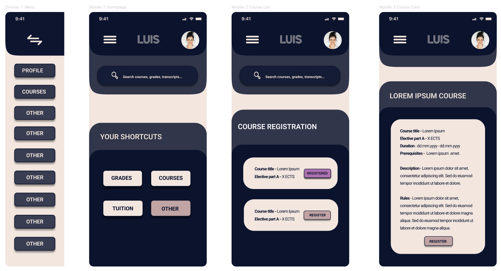
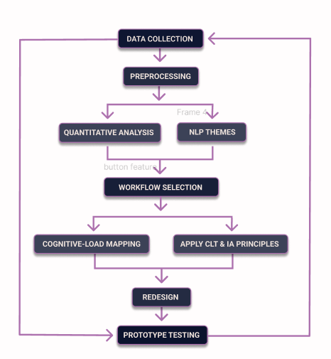

<!-- Social preview for GitHub and Twitter -->
<meta property="og:image" content="https://github.com/aliiane/LUIS-Usability-Thesis-Zogota/raw/main/banner.png" />
<meta property="og:title" content="Master’s thesis project – improving LUIS usability through UX redesign and data analysis" />
<meta property="og:description" content="Colab notebooks, survey analysis, Figma prototypes and final thesis file for improving academic UX." />

**Master's Thesis Project – Alīna Žogota-Kiliča**

"IMPROVING AN ACADEMIC INFORMATION SYSTEM THROUGH COGNITIVE LOAD PRINCIPLES AND USER-CENTERED INFORMATION ARCHITECTURE: A CASE STUDY OF LUIS"

Riga Technical University
Digital Humanities MSc | Student ID: 241RHM001

**Project Summary**

This project analyses the Latvian Academic Information System (LUIS) using usability principles, cognitive load theory, and user-centered design. Based on survey data, prototype tests, and workflow analysis, it proposes and evaluates improved workflows for students and administrative staff.

**The work includes:**

1. Survey data collection (usability and prototype feedback)

2. Data cleaning and transformation

3. Three Google Colab notebooks with analysis (quant + NLP)

4. Workflow redesigns in Figma

5. Live prototype tests and feedback forms

6. Final thesis file (PDF in /docs)

**Folder Structure**

/data        → All cleaned and final Excel/CSV datasets  
/docs        → Thesis document  
/notebooks   → Google Colab notebooks (.ipynb and PDF versions)  
/surveys     → PDF versions of all Google Forms (questions and responses)

**Notebooks (Colab)**

All notebooks were created and run in Google Colab.
If you're using this repository, update file paths in code to match your environment.

/notebooks/LUIS_Prototype_Test_Zogota.ipynb

/notebooks/LUIS_Usability_Survey_Analysis_Zogota.ipynb

/notebooks/NLP_Processing_LUIS_Usability_Zogota.ipynb

**Data Files**

Stored in /data:

LUIS Usability Survey (Responses).xlsx

LUIS_Usability_Survey_Cleaned.xlsx

LUIS_Usability_Survey_Final.csv

LUIS_Usability_Survey_Final_NLP.csv

Workflow_Prototype_Test.csv

Workflow_Prototype_Test_Cleaned.csv

**Survey Forms (Google Forms)**

First usability survey:
https://docs.google.com/forms/d/1iNduA1BEcRpB94fOowBFbW3ps9Mq45Mn4NtR2quHZao/edit

Student desktop prototype survey:
https://docs.google.com/forms/d/1QK8WAgaQdCBgwKitUwyu9LBv_RroApEtlLEz8u80BTE/edit

Student mobile prototype survey:
https://docs.google.com/forms/d/1ijo1VBDsBj95vbPc3fpgaQmX_AlLTJm1S-B7yo6uicI/edit

Admin desktop prototype survey:
https://docs.google.com/forms/d/1ysVpEfu3-vy0dEzDt2N_cq9xDcgLDRKtu7aB-SevADM/edit

**Figma Prototypes**

Main file with workflow design:
https://www.figma.com/design/wopn6cWNtnmSnjgLJHZ33Y/Zogota_Thesis_Workflows?node-id=32-22&t=dAgeds4aWI3YbpFh-1

Desktop Workflow 2 prototype (**Task- Upload grades using the Excel upload option.**):
https://www.figma.com/proto/wopn6cWNtnmSnjgLJHZ33Y/Zogota_Thesis_Workflows?node-id=4943-2074&p=f&t=Gll3UQJx0LsskbME-1&scaling=contain&content-scaling=fixed&page-id=4943%3A1741&starting-point-node-id=4943%3A2074

Desktop Workflow 1 prototype  (**Task- Enroll into the Marketing course.**):
https://www.figma.com/proto/wopn6cWNtnmSnjgLJHZ33Y/Zogota_Thesis_Workflows?node-id=4943-1068&p=f&t=GNflveEFvM9gmhx5-1&scaling=contain&content-scaling=fixed&page-id=4943%3A864&starting-point-node-id=4943%3A1068

Mobile Workflow 1 prototype  (**Task- Enroll into the Marketing course.**):
https://www.figma.com/proto/wopn6cWNtnmSnjgLJHZ33Y/Zogota_Thesis_Workflows?node-id=4932-1794&p=f&t=g6FzfLPAuTHl0lc6-1&scaling=scale-down&content-scaling=fixed&page-id=4932%3A1147&starting-point-node-id=4932%3A1794

**Thesis Document**

Full thesis is located in /docs.

License

This work is for academic and educational purposes only.
Please contact alina.zogota@gmail.com
 for citation or use.
 

